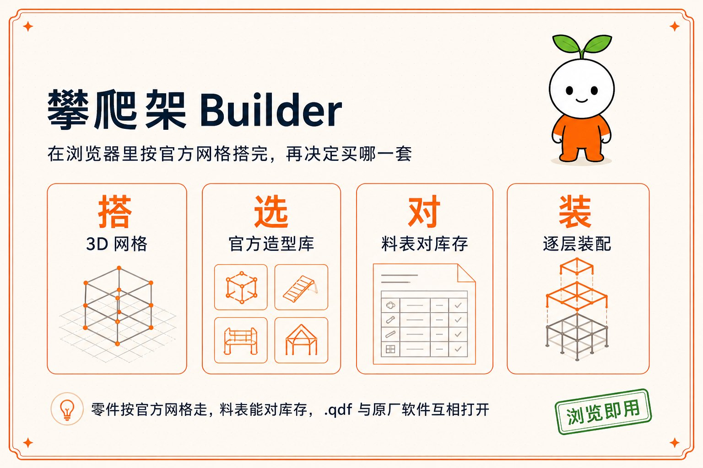
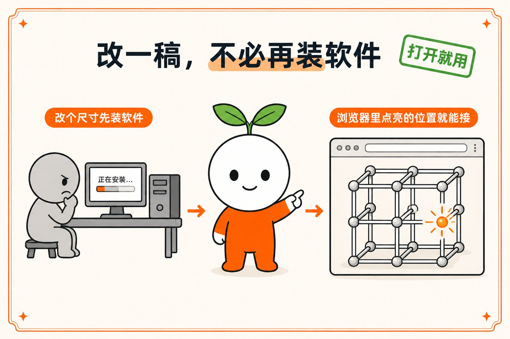
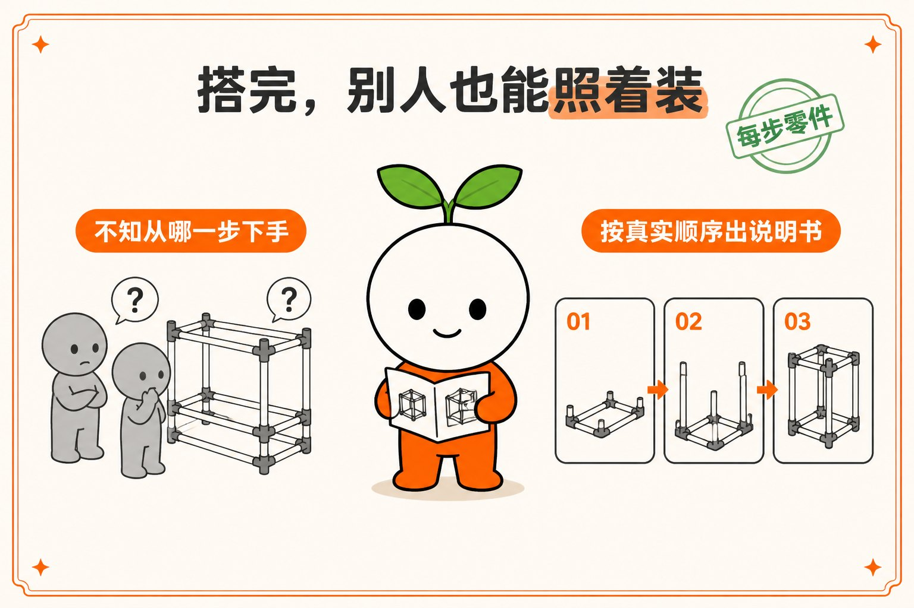
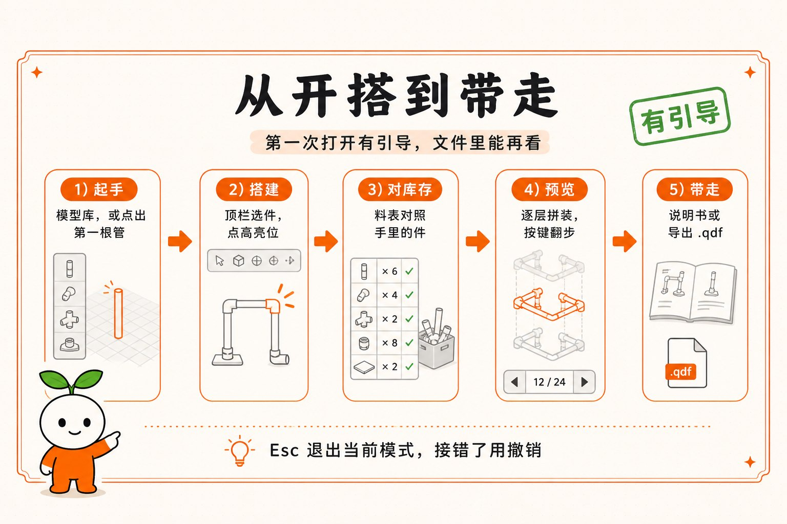

# Quadro Builder

[清禾](https://qinghe.io/) 做的 QUADRO 攀爬架浏览器设计器。打开网页就能按官方网格搭，搭完能出料表、对库存、导出拼装说明书。`.qdf` 能和原厂软件互相打开。

在线使用：[qinghe.io](https://qinghe.io/)

QUADRO 是原厂商标。这是非官方社区工具，和 QUADRO GmbH 没有关系。

<p align="center">
  
</p>

零件按官方网格走，料表能对库存，`.qdf` 与原厂软件互相打开。浏览器打开就能用。

## 动手之前，常卡在这三件事

### 改一稿，不必再装软件

原厂设计软件要下载安装，还挑操作系统。只想把一根横杆挪高五厘米，先得折腾半小时。

这里打开就能改。网格上能接的位置会亮起来，点一下就接上。

<p align="center">
  
</p>

### 搭完，别人也能照着装

成品图看不出装配顺序。装到一半才发现底层少了一根，只能拆掉重来。

按真实装配顺序一层一层翻，每步用到哪几个零件都列在旁边。

<p align="center">
  
</p>

### 缺件别等到装一半

家里存了多少管子、多少接头，全凭印象。缺一个就得停下来等货。

搭完自动生成料表：需要多少、现有多少、还差多少逐行列出。缺的先补齐再动手。

<p align="center">
  
</p>

## 怎么用

第一次打开有引导，会高亮界面上的真实按钮。「文件 → 再看一遍引导」可以随时回来。

<p align="center">
  
</p>

1. **起手**  
   右栏「模型库」打开官方造型或起步示例；也可以顶栏选「管」，空场景点一下长出第一根。

2. **搭建**  
   顶栏选零件，点场景里高亮的位置装上。左栏改颜色。接错了撤销，或按 D 进删除模式点掉。

3. **对库存**  
   「零件清单」看用了什么；「我的库存」填手里的数量。「选购建议」会列出还缺哪些件、该买哪套。

4. **预览**  
   底部「逐层拼装」（或按 A）按真实顺序翻步。`[` `]` 切换步骤。

5. **带走**  
   ⌘S 存进「我的设计」。给别人搭：导出拼装说明书 PDF。给别人改：复制分享链接，或导出 `.qdf`。

Esc 退出当前模式。标签栏可以同时开多个设计，关掉未保存的标签前会问一次。

## 功能

**搭建** — 管、连接件、面板、轮、布件、泳池、滑梯、加固，按官方网格吸附。经典四色和 Home 柔和色，可按家族换色或全部改成同色。支持选择、框选、整块选择、复制粘贴（可升降楼层）、旋转、删除。多标签同时开几个设计。

**模型库** — 约 495 个官方造型，卡片是空背景 3D 图；第一次打开某条会从官网下 QDF，之后缓存在本机。起步造型（立方框、塔、桌、隧道、金字塔等）可挂到指针上再放下。本地 `.qdf` 可单文件或整夹导入。

**料表和选购** — 「零件清单」按类列出，点一行会在场景里标出对应零件。「我的库存」按可买配件目录填写数量（管 / 接头 / 板 / 滑梯 / 轮 / 布 / 泳池衬 / 管帽 / 加固 / 螺丝），可搜索、按全部 / 已有 / 缺件筛选，也可导入导出 JSON。店里不单卖的件默认不出现，当前造型用到的仍会列出来。「选购建议」对照官方件看缺什么、哪套能盖住；中文界面套装价按人民币显示。

**视图** — 左上三个按钮：草地、框住模型（F）、导出说明书。房间边界可填家里能摆下的宽深高；超尺寸只在右栏警告，不拦住搭建。

**导出** — 拼装说明书 PDF（封面成品图、每步正反两张、本步零件、总料表）；`.qdf`（和原厂软件互开；Home 色导出会落到官方红绿蓝黄）；JSON、PNG。分享链接把设计写进网址，对方打开即见，不用账号。「我的设计」存在本机浏览器。

界面中 / EN / DE。可安装成 PWA；已经缓存过的页面离线也能打开，官方模型第一次仍要联网下载 QDF。

## 界面

| 位置 | 做什么 |
| --- | --- |
| 顶栏 | 选择、删除、管、面板、连接件、轮、布件、泳池、滑梯、加固 |
| 左栏 | 颜色、一键换色 |
| 左上三个按钮 | 草地、框住模型、导出说明书 |
| 画布上方 | 设计标签 |
| 右栏 | 文件、我的设计、模型库、选购建议、零件清单、我的库存 |
| 底栏 | 逐层拼装 |
| 左下角 | 当前模式能用的快捷键，点标题可收起 |

窗口变窄时，左栏和三个按钮会落到工具栏下面，避免叠在一起。

### 怎么搭

1. **管**：选长度后点接头上的箭头，往空方向接一根。连接件会按已经接上的管子长出来。数字键 1–6 换管长（15 / 25 / 35 / 10 / 20 / 75 cm）。
2. **连接件**：空场景会直接落在原点。已经有结构时，只高亮还能套上所选型号的现有接头。点一下换成该通型，再点可转动空插座。
3. **面板**：先点一根承重管（琥珀色），再点对面那根绿色的。
4. **滑梯**：选官方四种之一，点挂钩或滑梯链位置。
5. **轮 / 布 / 泳池 / 45° / 双管 / 管夹 / 孔锁 / 柔性接头**：从顶栏拿出，吸到高亮点上。
6. **加固**：点两根共线的 35 cm 管，插入 80 cm 木芯。

`.qdf` 从「文件」导入或导出。官方网格和特殊件用 JSON 保真。

### 快捷键

快捷键按系统显示：Mac 用 ⌘，Windows 用 Ctrl。

| 操作 | 键 |
| --- | --- |
| 撤销 / 重做 | ⌘Z / ⇧⌘Z（Windows：Ctrl+Z / Ctrl+Y） |
| 保存 | ⌘S |
| 全选 | ⌘A |
| 复制 / 粘贴 | ⌘C / ⌘V。粘贴后 ↑↓ 升降，点击放下，Esc 取消 |
| 选择整块 | 双击，或 L，或左栏「选择整块 L」。Shift/⌘ 加点选 |
| 旋转选中 | Q 逆时针 / E 顺时针 |
| 删除模式 | D。点零件逐个删除，Esc 或再按 D 退出 |
| 删除选中 | Delete / Backspace |
| 框住模型 | F |
| 逐层拼装 | A，`[` `]` 翻步 |
| 退出当前模式 | Esc |

相机：拖动旋转；Mac 用 ⌥ 拖或 ⇧+双指横移、双指缩放；Windows 用 Alt 拖或 Shift+滚轮横移、滚轮缩放。

## 本地运行

需要 Node 22+ 和 [pnpm](https://pnpm.io/)。本机若用 Homebrew 的 `node@24`：

```bash
export PATH="/opt/homebrew/opt/node@24/bin:$PATH"
pnpm install
pnpm dev
```

浏览器打开终端里打印的地址，一般是 `http://localhost:5173/`。端口被占用时 Vite 会顺延。

```bash
pnpm exec tsc -b --noEmit   # 类型检查
pnpm build                  # 产出 dist/
pnpm preview                # 预览生产包
```

打开官方模型时，开发服务器会把 `/mdb-files` 代理到 `https://mdb.quadroworld.com`。缩略图在本仓库 `public/thumbs/`，不走官网。

## 目录

```
src/engine/     搭建引擎（Vanilla JS；相对上游只改了数据路径和 Three 导入）
src/ui/         工作台界面
src/store/      引擎和 React 之间的桥
src/data/       起步造型、官方模型列表、套装建议、库存目录
src/sync/       可选的云端同步（本地默认关闭）
public/data/    零件目录，以及从原厂程序抽出的网格
public/thumbs/  官方和起步造型的空背景缩略图
docs/shots/     README 用的产品图
```

界面按 [vokako/quadro-3d-designer](https://github.com/vokako/quadro-3d-designer) 重做；搭建、QDF、料表、官方网格用的是 [thecodingdad/quadro-3D](https://github.com/thecodingdad/quadro-3D) 的引擎。两边都是 MIT。本项目不是把 designer 整仓拷过来当底座，3D 也不是 React Three Fiber。

## 许可

MIT。见 [LICENSE](LICENSE)。
