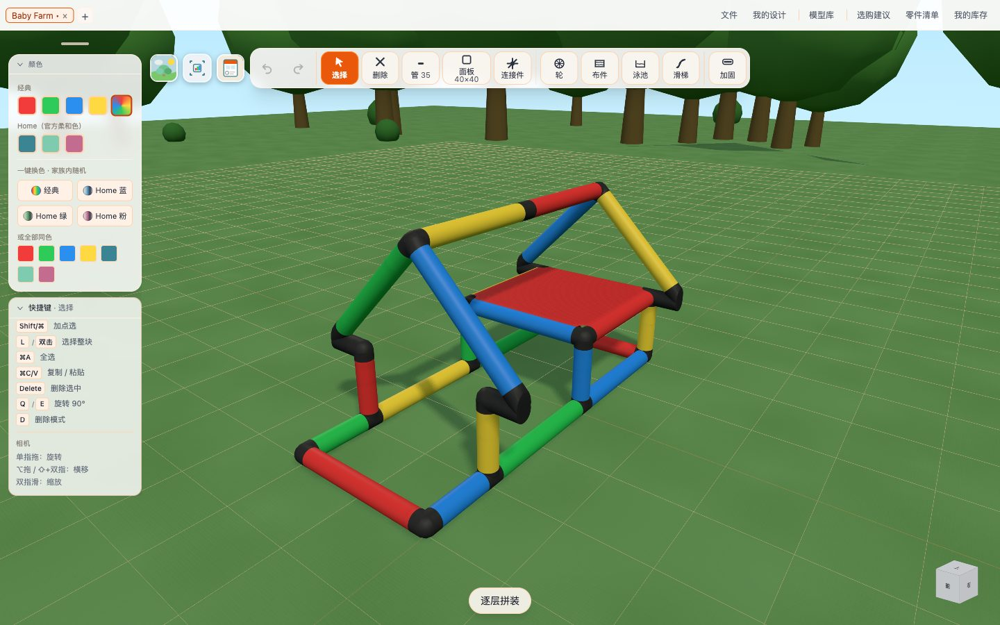
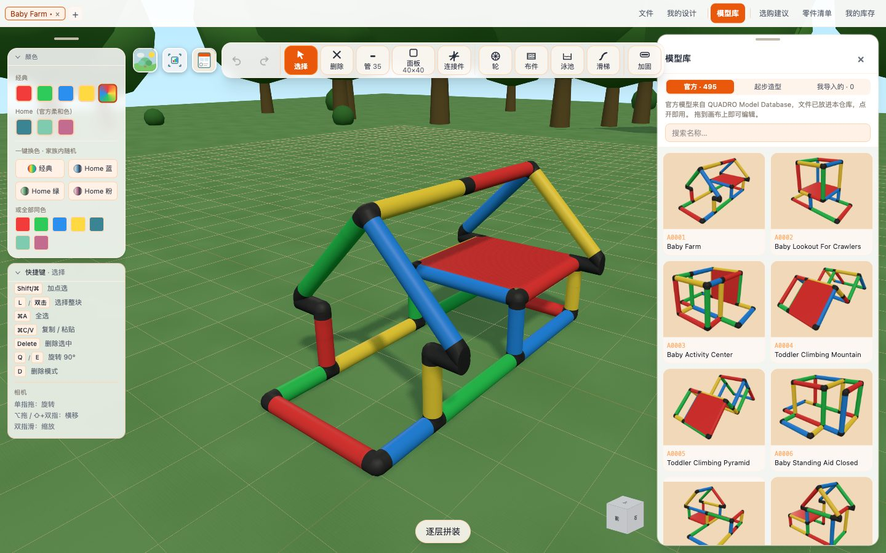
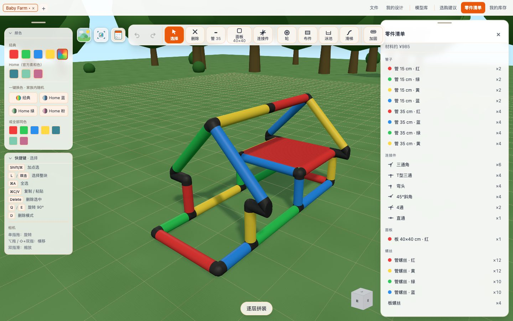
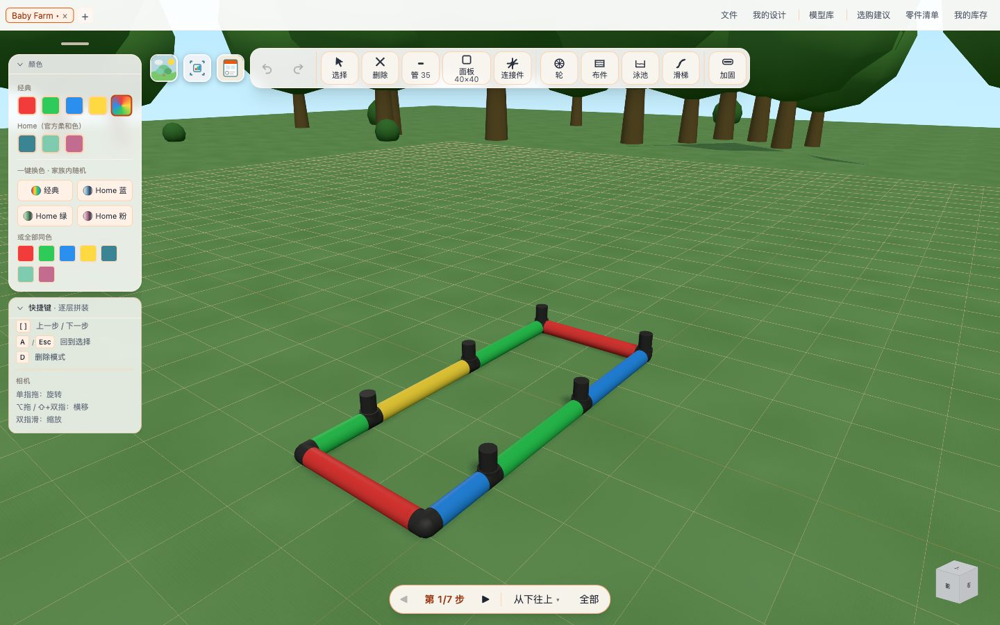
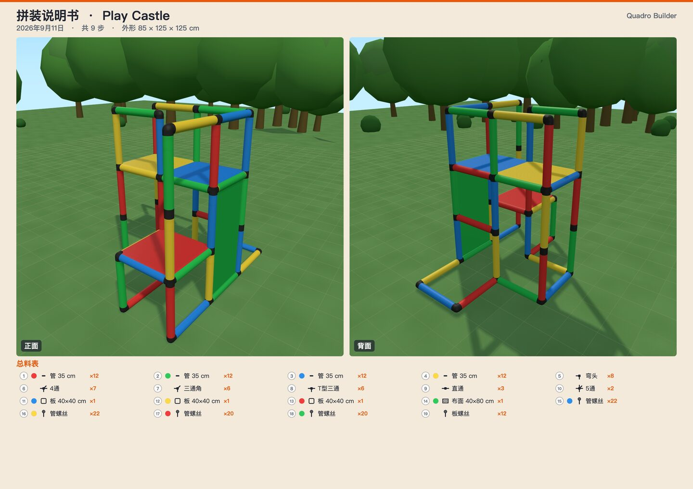
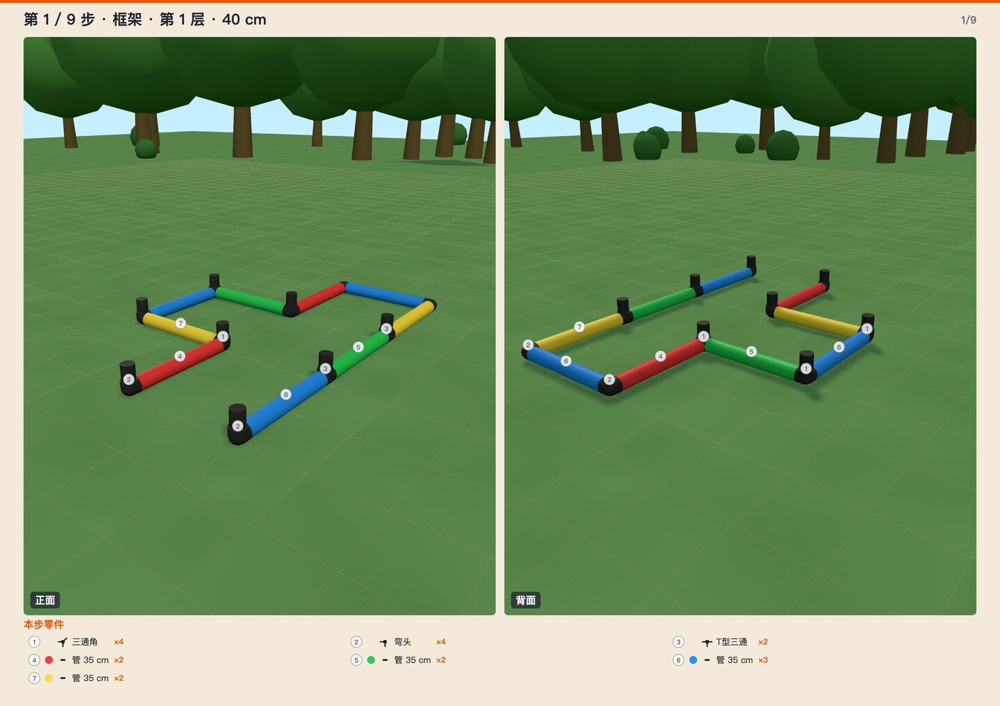

# Quadro Builder

小麦坊做的 QUADRO 攀爬架浏览器设计器。打开网页就能按官方网格搭：浏览器里改、模型能发布、家里的零件能记账、多的配件能挂出去、搭完能出安装手册。`.qdf` 能和原厂软件互相打开。AI 设计还没上线。

在线使用：[xiaomaifang.com/builder](https://xiaomaifang.com/builder/)

QUADRO 是原厂商标。这是非官方社区工具。

## 能做什么

<table>
  <tr>
    <td></td>
    <td></td>
    <td></td>
  </tr>
  <tr>
    <td></td>
    <td></td>
    <td></td>
  </tr>
</table>

1. **在线编辑** — 浏览器里搭，不用装软件。能接的位置会亮。
2. **模型社区** — 广场上的模型能打开改，也能发布。
3. **库存管理** — 家里有什么记一笔。搭完对着看差多少。
4. **配件交易** — 多的挂出去，缺的发求购。联系自己要。平台不验货、不经手。
5. **安装手册** — 一层一层往上搭。每步用哪几个零件都在旁边。
6. **AI 设计** — 用一句话说想搭什么样，先出一稿，再自己改。还未上线。

## 功能展示

工作台。顶栏选零件，左栏改颜色，草地场景里直接搭。



模型库。约 495 个官方造型，点卡片打开就能改。



零件清单。管子、接头、板、螺丝按类列出，点一行会在场景里标出来。



逐层拼装。从下往上翻，当前这一层高亮，旁边能看到这一步用哪些件。



拼装说明书。左上角导出 PDF：封面是成品正反面和总料表，后面一步一页，每页正反两张，下列本步零件。下面是官方造型 Play Castle（A0036）导出的封面和第 1 步。





界面中 / EN / DE。可安装成 PWA；已经缓存过的页面离线也能打开。

窗口变窄时，左栏和三个按钮会落到工具栏下面，避免叠在一起。

## 怎么用

第一次打开有引导，会高亮界面上的真实按钮。「文件 → 再看一遍引导」可以随时回来。

1. **起手**
  右栏「模型库」打开官方造型，或从「起步造型」里拿单元：基础几何、游乐单元（护栏平台、台阶、滑梯塔、隧道屋、双塔连桥、攀爬三角架、秋千门架、沙坑框）、屋顶。点一下挂到指针上，放到现有造型上会合并。也可以顶栏选「管」，空场景点一下长出第一根。
2. **搭建**
  顶栏选零件，点场景里高亮的位置装上。左栏改颜色。接错了撤销，或按 D 进删除模式点掉。
3. **对库存**
  「零件清单」看用了什么；「我的库存」填手里的数量。「选购建议」会列出还缺哪些件、该买哪套。
4. **看安全**
  右上「安全」按 QUADRO 官方安全须知逐条检查：悬空的管端、板边下面没管、60 cm 以上的 40×20 开口、层间落差、坠落高度对应的地面、平台固定、倾覆、四周留空，另有两条参考规则（没落地、高处没护栏）。每条带须知章节号，点一条场景里亮出对应零件。只作参考。
5. **预览**
  底部「逐层拼装」（或按 A）按真实顺序翻步。`[` `]` 切换步骤。
6. **带走**
  ⌘S（Windows：Ctrl+S）存进「我的设计」。给别人搭：导出拼装说明书 PDF。给别人改：复制分享链接，或导出 `.qdf`。

Esc 退出当前模式。标签栏可以同时开多个设计，关掉未保存的标签前会问一次。

### 怎么搭

1. **管**：选长度后点接头上的箭头，往空方向接一根。连接件会按已经接上的管子长出来。数字键 1–6 换管长（15 / 25 / 35 / 10 / 20 / 75 cm）。
2. **连接件**：空场景会直接落在原点。已经有结构时，只高亮还能套上所选型号的现有接头。点一下换成该通型，再点可转动空插座。
3. **面板**：先点一根承重管（琥珀色），再点对面那根绿色的。下拉里除了 40×40、40×20、30×30，还有洞洞板和透明窗板。透明窗板是一块带缺口的框板加一片 35×35 亚克力，料表里分成框板、亚克力片、亚克力螺丝三行；导出 .qdf 时原厂软件把它当同色的普通板显示，导回来还是透明窗板。
4. **滑梯**：选官方四种之一，点挂钩或滑梯链位置。
5. **轮 / 布 / 泳池 / 45° / 双管 / 管夹 / 孔锁 / 柔性接头**：从顶栏拿出，吸到高亮点上。双管夹点一下转 45°，拖着绕管可转到任意角（Shift 按 15° 一档）；选择模式里选中夹子同样能转，同一根管子上带着第二根管的夹子会一起转。第二根管可沿第一根平移（夹子不动），端点会吸到第一根上。
6. **加固**：点两根共线的 35 cm 管，插入 80 cm 木芯。

`.qdf` 从「文件」导入或导出。官方网格和特殊件用 JSON 保真。Home 色导出会落到官方红绿蓝黄。

### 快捷键

快捷键按系统显示：Mac 用 ⌘，Windows 用 Ctrl。


| 操作      | 键                                 |
| ------- | --------------------------------- |
| 撤销 / 重做 | ⌘Z / ⇧⌘Z（Windows：Ctrl+Z / Ctrl+Y） |
| 保存      | ⌘S                                |
| 全选      | ⌘A                                |
| 复制 / 粘贴 | ⌘C / ⌘V。粘贴后 ↑↓ 升降，点击放下，Esc 取消     |
| 选择整块    | 双击，或 L，或左栏「选择整块 L」。Shift/⌘ 加点选    |
| 旋转选中    | Q 逆时针 / E 顺时针                     |
| 删除模式    | D。点零件逐个删除，Esc 或再按 D 退出            |
| 删除选中    | Delete / Backspace                |
| 框住模型    | F                                 |
| 逐层拼装    | A，`[` `]` 翻步                      |
| 退出当前模式  | Esc                               |


相机：拖动旋转；Mac 用 ⌥ 拖或 ⇧+双指横移、双指缩放；Windows 用 Alt 拖或 Shift+滚轮横移、滚轮缩放。

## 本机部署

需要 Node 22+、[pnpm](https://pnpm.io/) 和 Git。开发用 `pnpm dev`，上线先 `pnpm build` 打出 `dist/`。

官方造型的 `.qdf`（约 495 个）和缩略图都在仓库里，clone 大约几十 MB，不用代理官网。

### 安装 Node 和 pnpm

**macOS**（[官网安装包](https://nodejs.org/)，或 Homebrew）：

```bash
brew install node@24
echo 'export PATH="/opt/homebrew/opt/node@24/bin:$PATH"' >> ~/.zshrc
source ~/.zshrc
corepack enable
```

Intel Mac 把 `/opt/homebrew` 换成 `/usr/local`。

**Windows**（PowerShell；不要复制上面的 `export PATH`）：

```powershell
winget install OpenJS.NodeJS.LTS
winget install Git.Git
```

关掉窗口再开一个新的 PowerShell，然后 `corepack enable`。没有 corepack 时改用 `npm install -g pnpm`。仓库尽量放短路径，例如 `C:\src\`。

### 跑起来

```bash
git clone https://github.com/Neytoph/quadro-builder.git
cd quadro-builder
pnpm install
pnpm dev
```

浏览器打开终端里打印的地址，一般是 `http://localhost:5173/`。端口被占用时 Vite 会顺延。

```bash
pnpm build
pnpm preview    # 一般是 http://localhost:4173/
```

### 放到网上

把 `dist/` 交给 Nginx、Caddy、Cloudflare Pages 等静态托管即可。官方造型在 `dist/qdf/`，缩略图在 `dist/thumbs/`，不用再配反向代理。

注意：

- 挂在**域名根路径**。子路径要先改 Vite 的 `base` 再构建。
- 未知路径回到 `index.html`（单页应用）。`pnpm preview` 已经这样做；裸的 `python -m http.server` 不会。

Nginx 示例：

```nginx
server {
  listen 80;
  server_name example.com;
  root /var/www/quadro-builder/dist;
  index index.html;

  location / {
    try_files $uri $uri/ /index.html;
  }
}
```

本机自己跑不必配置 `VITE_SYNC_BASE`、`VITE_ANALYTICS_URL`，默认同步和埋点都是关掉的。

改过起步造型之后跑一遍 `npx vite-node scripts/check-presets.mjs`：每个单元都要能进模型、没有碰撞、每个接头都是真实可买的零件。缩略图用 `pnpm dev` 后打开 `/?capture-thumbs` 自动补齐缺的那几张。

## 目录

```
src/engine/     搭建引擎（Vanilla JS；相对上游只改了数据路径和 Three 导入）
src/ui/         工作台界面
src/store/      引擎和 React 之间的桥
src/data/       起步造型、官方模型列表、套装建议、库存目录
src/sync/       可选的云端同步（本地默认关闭）
public/data/    零件目录，以及从原厂程序抽出的网格
public/qdf/     官方造型的 .qdf（约 495 个）
public/thumbs/  官方和起步造型的空背景缩略图
docs/shots/     README 用的产品图和界面截图（含 home-six 六张能力卡）
```

## 许可

版权归小麦坊所有。未经书面许可，不得商用。见 [LICENSE](LICENSE)。

上游 MIT 原文在 [licenses/upstream-MIT.txt](licenses/upstream-MIT.txt)，使用那些部分时须保留原版权声明。

感谢 [vokako/quadro-3d-designer](https://github.com/vokako/quadro-3d-designer)、[thecodingdad/quadro-3D](https://github.com/thecodingdad/quadro-3D)。
 